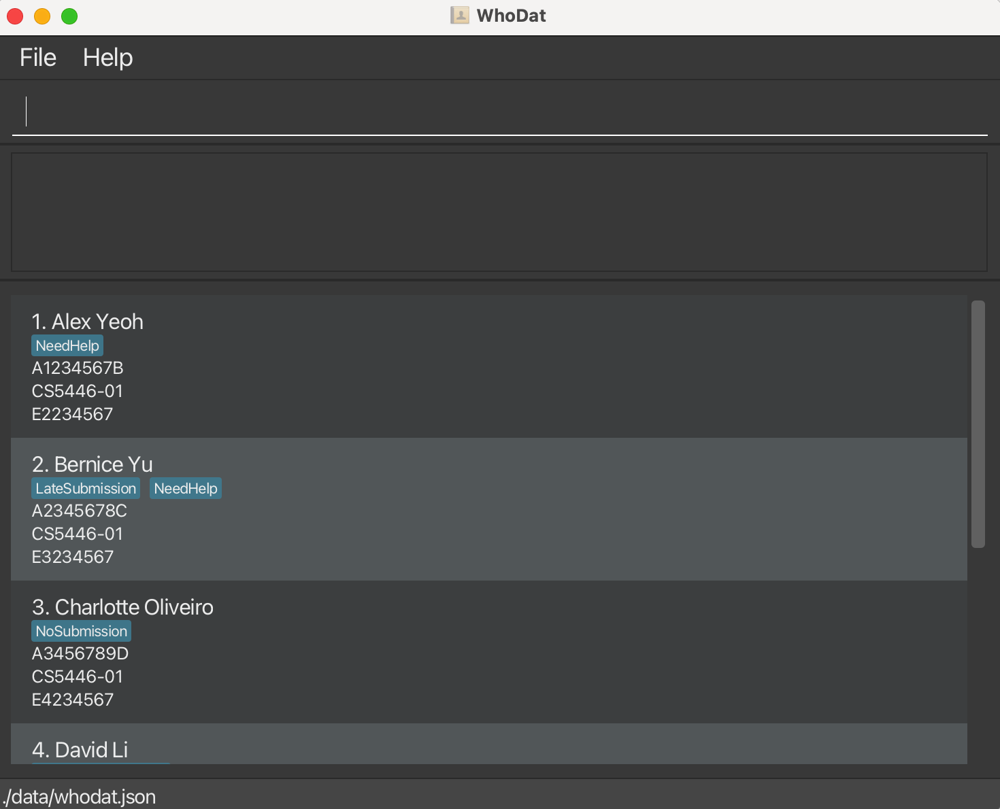

## WhoDat

* `WhoDat` is a desktop app. It helps teaching assistants from NUS Computing to efficiently manage student contact details.
  * It is **written in OOP fashion**. It provides a **reasonably well-written** code base **bigger** (around 6 KLoC) than what students usually write in beginner-level SE modules, without being overwhelmingly big.
  * It comes with a **reasonable level of user and developer documentation**.
* For the detailed documentation of this project, see the **[WhoDat Product Website](https://ay2425s2-cs2103t-t14-3.github.io/tp/)**.
* This project is based on the AddressBook-Level3 project created by the [SE-EDU initiative](https://se-education.org).
* This project is a **part of the se-education.org** initiative. If you would like to contribute code to this project, see [se-education.org](https://se-education.org/#contributing-to-se-edu) for more info.

