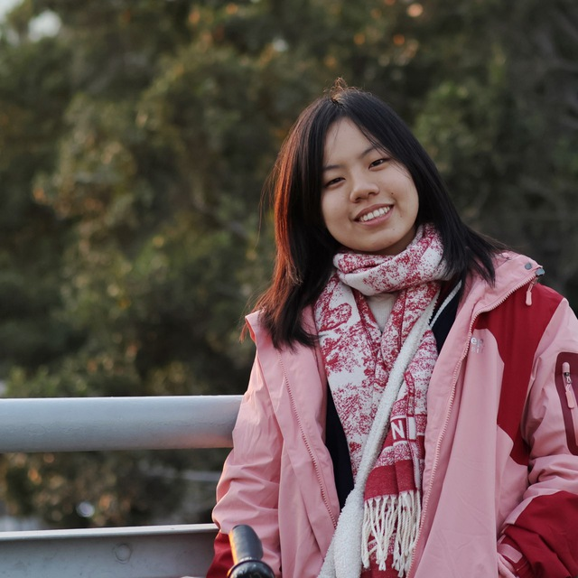
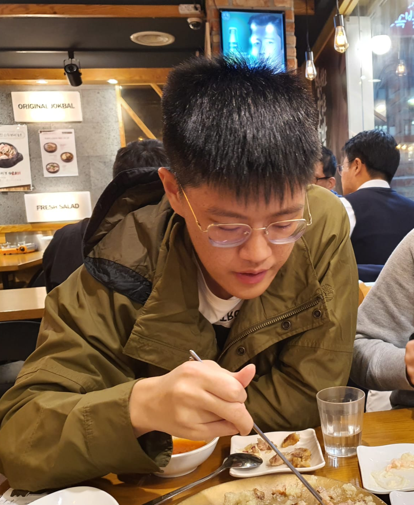

# About Us

We are a team based in the [School of Computing, National University of Singapore](http://www.comp.nus.edu.sg).

You can reach us at the email `seer[at]comp.nus.edu.sg`

## Project team

### Lin Xinyi

[[homepage](http://www.comp.nus.edu.sg/~damithch)]
[[github](https://github.com/xinnnyeee)]
[[portfolio](team/johndoe.md)]

* Role: Project Member
* Responsibility: Deliverables and Deadlines

### Jane Doe

[[github](http://github.com/johndoe)]
[[portfolio](team/johndoe.md)]

* Role: Team Lead
* Responsibilities: UI

### Johnny Doe

[[github](http://github.com/johndoe)] [[portfolio](team/johndoe.md)]

* Role: Developer
* Responsibilities: Data

### Joshua Lai

[[github](http://github.com/laishuya)]
[[portfolio](https://www.linkedin.com/in/joshua-lai-401b65278)]

* Role: Documentation
* Responsibilities: Quality of project documents

### James Doe

[[github](http://github.com/johndoe)]
[[portfolio](team/johndoe.md)]

* Role: Developer
* Responsibilities: UI
